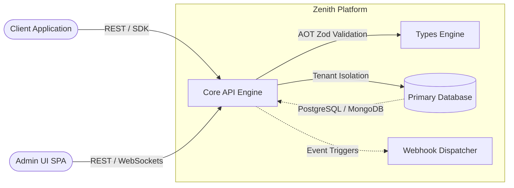

<div align="center">
  
  <h1>Zenith CMS</h1>
  <p><strong>The Industrial Operational Platform for High-Fidelity Digital Ecosystems.</strong></p>
  
  <p align="center">
    <a href="https://github.com/AmanTShekar/Zenith-CMS/releases">
      
    </a>
    <a href="https://nodejs.org/">
      
    </a>
    <a href="https://pnpm.io/">
      
    </a>
    <a href="https://www.typescriptlang.org/">
      
    </a>
    <a href="LICENSE">
      
    </a>
  </p>
</div>

<br />

> [!NOTE]  
> Zenith CMS is currently in `v1.0.0-beta`. The platform is actively maintained for production trials, but expect rapidly evolving internal API surfaces until the final v1 release.

---

## Overview

Zenith CMS is an enterprise-grade headless content management system engineered for maximum throughput, absolute type safety, and deep extensibility. Designed for modern software teams, Zenith bridges the gap between editorial flexibility and strict engineering constraints.

Built atop a hyper-optimized monorepo leveraging **Drizzle ORM**, **Turborepo**, **React/Vite**, and **TypeScript**, Zenith natively handles multi-tenant scaling, programmatic schemas, and strict zero-trust security pipelines out of the box.

---

## System Architecture

Unlike traditional monolithic platforms, Zenith executes inside a highly decoupled, composable monorepo architecture. 


```mermaid
flowchart LR
    Client([Client Application]) -->|REST / SDK| Core[Core API Engine]
    Admin([Admin UI SPA]) -->|REST / WebSockets| Core
    
    subgraph Zenith Platform
        Core -->|AOT Zod Validation| Types[Types Engine]
        Core -->|Tenant Isolation| DB[(Primary Database)]
        Core -.->|Event Triggers| Webhooks[Webhook Dispatcher]
    end

    DB -.->|PostgreSQL / MongoDB| Core
```

- **`@zenith-open/zenithcms-core`**: The Node.js REST kernel. Employs Ahead-of-Time (AOT) schema validation via Zod, stopping malicious payloads before controller execution.
- **`@zenith-open/zenithcms-admin`**: The editorial control plane. A blazing-fast, React-based Single Page Application (SPA) compiled via Vite, featuring dark-mode ergonomics and granular modular UI.
- **`@zenith-open/zenithcms-types`**: The unified contract layer. Guarantees end-to-end type safety between the database edge and the client browser.
- **`@zenith-open/zenithcms-sdk`**: A zero-dependency, strongly-typed TypeScript SDK for seamless integration into Next.js, Nuxt, or Astro frontends.

---

## Core Capabilities

> [!TIP]  
> Need to extend the core? Zenith features a robust Plugin Engine that seamlessly injects new routes, database schema patches, and React UI tabs into the platform lifecycle. Refer to the [Plugin Development Guide](docs/PLUGINS.md).

- **Zero-Trust Security**: Granular Role-Based Access Control (RBAC), automatic cryptographic payload signing, and automated token invalidation scopes.
- **Database Agnostic Edge**: Native, high-performance adapters for both **PostgreSQL** and **MongoDB** through unified Drizzle schemas.
- **Multiplayer CRDTs**: Real-time collaborative document editing powered by Conflict-free Replicated Data Types.
- **Event-Driven Webhooks**: Configure declarative HTTP callbacks to trigger Vercel deployments, internal CI/CD pipelines, or Slack notifications instantly upon content state mutations.
- **Deep AI Integration**: Built-in neural bridge modules for dynamic SEO generation and editorial assistance.

---

## Quick Start

Ensure you are running **Node.js >= 20.11.0** and **pnpm >= 9**.

```bash
# 1. Clone the repository
git clone https://github.com/AmanTShekar/Zenith-CMS.git
cd Zenith-CMS

# 2. Install dependencies across the workspace
pnpm install

# 3. Provision local environment variables
cp .env.example .env

# 4. Boot the development cluster (Core API + Admin Dashboard)
pnpm dev
```

The Core API will execute on `http://localhost:3000` and the Admin Control Plane on `http://localhost:5173`.

> [!IMPORTANT]  
> When running the initial setup, a default Super Admin account will be generated. Check your terminal output for the bootstrap credentials.

---

## Technical Documentation Index

Explore our exhaustive technical playbooks to master the platform. Each document provides deep engineering insights into the platform's subsystems.

| Domain | Runbook / Specification |
| :--- | :--- |
| **System Operations** | [Installation & Deployment Strategy](docs/INSTALLATION.md) |
| **Database Design** | [Schemas & Collection Modelling](docs/COLLECTIONS.md) |
| **Data Synchronization** | [Real-Time Collaboration & CRDTs](docs/COLLABORATION.md) |
| **Integrations** | [REST API Reference](docs/API.md) |
| **Extensibility** | [Plugin Engine](docs/PLUGINS.md) |
| **Extensibility** | [Custom Field Registration](docs/FIELD_REGISTRATION.md) |
| **Security Posture** | [Zero-Trust Implementation](SECURITY.md) |
| **Migration** | [Database Migration Runbook](docs/migration_runbook.md) |
| **Troubleshooting** | [Incident Resolution Guide](docs/ISSUE_GUIDE.md) |

---

## Contribution & Governance

Zenith is open-source and community-driven. We strictly enforce conventional commits, aggressive unit-testing via Vitest, and strict code formatting to ensure industrial stability.

Read our [**Contributing Protocol**](CONTRIBUTING.md) to initialize your Docker Devcontainer and submit your first Pull Request.

---

## License

Zenith CMS is distributed under the [MIT License](LICENSE). 

<div align="center">
  <i>Engineered with precision.</i>
</div>
