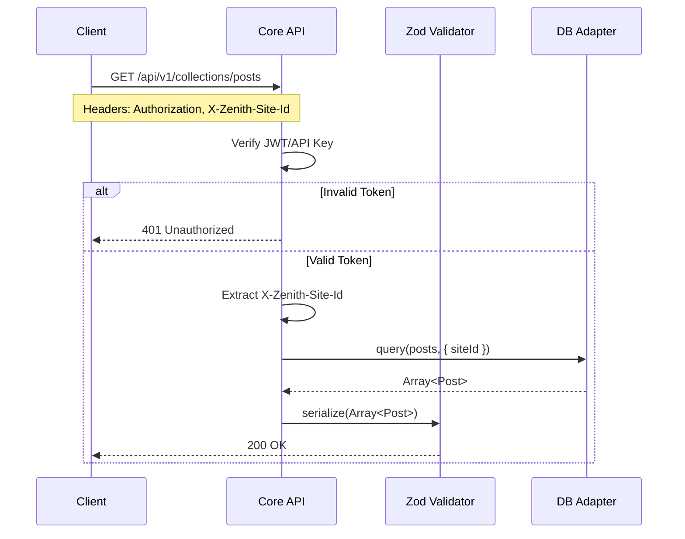

# REST API Specification

Zenith CMS exposes a highly optimized, fully typed REST API. All endpoints enforce multi-tenant isolation and strict Zod payload validation.

---

## Authentication & Authorization

All headless requests must provide authorization via HTTP headers.



### Required Headers
1. `Authorization: Bearer <token>` (or API Key)
2. `X-Zenith-Site-Id: <uuid>` (Mandatory for multi-tenant deployments)

---

## Standard Collection Endpoints

Assuming a collection named `posts`.

### `GET /api/v1/collections/:slug`
Retrieves a paginated list of documents.

**Query Parameters:**
- `page` (number, default: 1)
- `limit` (number, default: 10)
- `sort` (string, e.g., `-createdAt`)
- `where` (URL-encoded JSON filter object)

### `GET /api/v1/collections/:slug/:id`
Retrieves a single document by its UUID.

### `POST /api/v1/collections/:slug`
Creates a new document. Payload must strictly match the collection's configured Zod schema.

### `PATCH /api/v1/collections/:slug/:id`
Partially updates an existing document.

### `DELETE /api/v1/collections/:slug/:id`
Hard-deletes a document and triggers subsequent cascading `afterDelete` hooks.

---

## Filtering Syntax

Filters are passed via the `where` query parameter using MongoDB-style query operators, which are automatically translated for PostgreSQL databases by the Drizzle adapter.

```json
// Example: ?where={"status":{"$equals":"published"},"views":{"$gte":100}}
{
  "status": { "$equals": "published" },
  "views": { "$gte": 100 }
}
```

### Supported Operators
- `$equals`, `$notEquals`
- `$in`, `$notIn`
- `$gt`, `$gte`, `$lt`, `$lte`
- `$contains`, `$startsWith`

---

## Error Handling

Zenith API errors follow a standardized JSON format.

```json
{
  "error": "Validation Failed",
  "issues": [
    {
      "path": ["title"],
      "message": "String must contain at least 5 character(s)"
    }
  ],
  "timestamp": "2026-07-02T10:00:00Z"
}
```

- **400 Bad Request**: Malformed JSON or invalid query syntax.
- **401 Unauthorized**: Missing or expired credentials.
- **403 Forbidden**: Valid credentials, but insufficient RBAC privileges.
- **422 Unprocessable Entity**: Payload failed Zod schema validation.
- **404 Not Found**: Document or collection does not exist.
