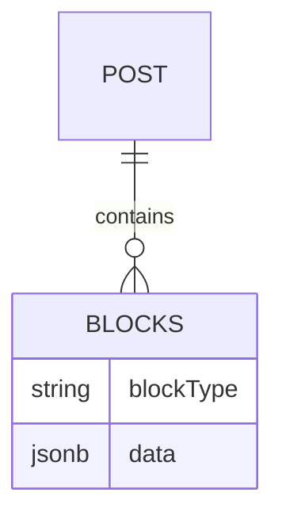

# Content Modelling & Collections

Zenith CMS manages content through strictly typed schemas defined in your `cms.config.ts`. These definitions are translated simultaneously into database structures (Drizzle/Mongoose) and validation schemas (Zod).

---

## 1. Defining a Collection

A Collection represents an entity type (e.g., "Posts", "Users", "Products").

```typescript
import { collection, field } from '@zenith-open/zenithcms-core';

export const Posts = collection({
  slug: 'posts',
  admin: {
    useAsTitle: 'title',
    group: 'Content',
  },
  fields: [
    field.text('title', { required: true }),
    field.slug('slug', { target: 'title' }),
    field.richText('content'),
    field.relation('author', { relationTo: 'users' })
  ]
});
```

---

## 2. Field Primitives

Zenith supports a wide array of field primitives that render automatically in the Admin UI:

- **`text` / `textarea`**: Standard string inputs.
- **`number`**: Numeric values (integer or float).
- **`boolean`**: True/false toggles.
- **`date`**: ISO-8601 Date/Time selector.
- **`select`**: Predefined enumerated lists.

---

## 3. Advanced Field Topologies

### Relations
The `relation` field allows you to link documents across collections. In PostgreSQL, this generates foreign key constraints or junction tables (for `hasMany` relationships).

```typescript
field.relation('categories', {
  relationTo: 'categories',
  hasMany: true,
})
```

### Arrays & Blocks
The `array` field allows repeatable sub-schemas. The `blocks` field enables polymorphic layout generation (e.g., a "Page Builder" where you can stack a "Hero" block, then a "Gallery" block).



---

## 4. Lifecycle Hooks

You can intercept database operations at the collection or field level.

```typescript
export const Posts = collection({
  slug: 'posts',
  hooks: {
    beforeChange: [
      async ({ data, req }) => {
        // Automatically set the author to the currently authenticated user
        if (!data.author) {
          data.author = req.user.id;
        }
        return data;
      }
    ]
  }
});
```

Available hooks include:
- `beforeValidate`
- `beforeChange`
- `afterChange`
- `beforeRead`
- `afterRead`
- `beforeDelete`
- `afterDelete`
